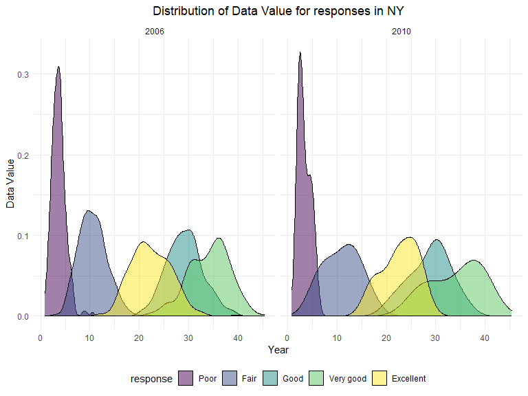
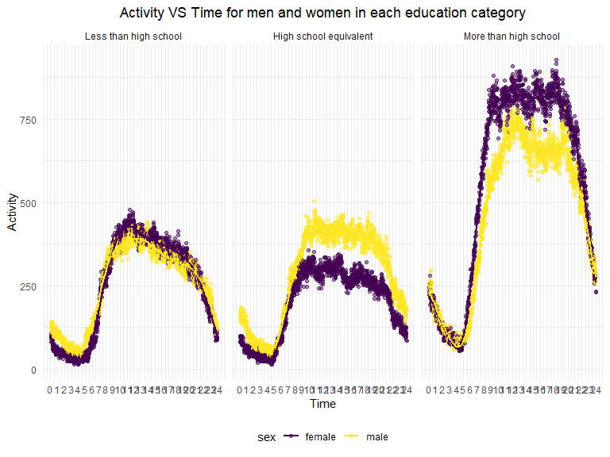

p8105_hw3_sc5126
================
Si Chen
2023-10-14

### Problem 2

**Load data & data cleaning**

``` r
data("brfss_smart2010")
smart = 
  brfss_smart2010 %>% 
  janitor::clean_names() %>% 
  filter(topic == "Overall Health") %>% 
  filter(response %in% c("Excellent", "Poor")) %>% 
  mutate(
    response = forcats::fct_relevel(as.factor(response), c("Poor", "Excellent"))
  )
```

**Answer Question**

``` r
# In 2002, which states were observed at 7 or more locations? 
smart %>% 
  filter(year == 2002) %>% 
  select(locationabbr, locationdesc) %>% 
  group_by(locationabbr) %>% 
  summarise(
    n_loc = n_distinct(locationdesc)
  ) %>% 
  filter(n_loc >= 7) 
```

    ## # A tibble: 6 × 2
    ##   locationabbr n_loc
    ##   <chr>        <int>
    ## 1 CT               7
    ## 2 FL               7
    ## 3 MA               8
    ## 4 NC               7
    ## 5 NJ               8
    ## 6 PA              10

``` r
# What about in 2010?
smart %>% 
  filter(year == 2010) %>% 
  select(locationabbr, locationdesc) %>% 
  group_by(locationabbr) %>% 
  summarise(
    n_loc = n_distinct(locationdesc)
  ) %>% 
  filter(n_loc >= 7)
```

    ## # A tibble: 14 × 2
    ##    locationabbr n_loc
    ##    <chr>        <int>
    ##  1 CA              12
    ##  2 CO               7
    ##  3 FL              41
    ##  4 MA               9
    ##  5 MD              12
    ##  6 NC              12
    ##  7 NE              10
    ##  8 NJ              19
    ##  9 NY               9
    ## 10 OH               8
    ## 11 PA               7
    ## 12 SC               7
    ## 13 TX              16
    ## 14 WA              10

In 2002, CT, FL, MA, NC, NJ, PA were observed at 7 or more locations. In
2010, CA, CO, FL, MA, MD, NC, NE, NJ, NY, OH, PA, SC, TX, WA were
observed at 7 or more locations.

``` r
# Construct a dataset that is limited to Excellent responses, and contains, year, state, and a variable that averages the data_value across locations within a state. 
#Make a “spaghetti” plot of this average value over time within a state (that is, make a plot showing a line for each state across years – the geom_line geometry and group aesthetic will help).

smart_exe_avg = 
  smart %>% 
  filter(response == "Excellent") %>% 
  group_by(locationabbr, year) %>% 
  mutate(
    avg_data_value = mean(data_value, na.rm = TRUE)
  ) %>% 
  select(
    locationabbr,
    year,
    avg_data_value
  )

smart_exe = 
  smart %>% 
  filter(response == "Excellent") %>% 
  inner_join(smart_exe_avg, by = c("locationabbr", "year")) %>% 
  select(
    locationabbr, year, avg_data_value, response
  ) %>% 
  distinct()
```

``` r
smart_exe %>% 
  ggplot(aes(x = year, y = avg_data_value, color = locationabbr)) + 
  geom_line() +
  xlab("Year") + 
  ylab("Average Data Value") +
  labs(color = "State")+
  ggtitle("Average data value over time within a state")+
  theme(legend.position = "bottom", plot.title = element_text(hjust=0.5))
```


``` r
# Make a two-panel plot showing, for the years 2006, and 2010, distribution of data_value for responses (“Poor” to “Excellent”) among locations in NY State
smart %>% 
  filter(year == 2006 | year == 2010 & locationabbr == 'NY') %>% 
  ggplot(aes(x = data_value, fill = response)) +
  geom_density(alpha = .5) + 
  facet_grid(~year) +
  xlab("Year") + 
  ylab("Data Value") +
  labs(title = "Distribution of Data Value for responses in NY")+
  theme(legend.position = "bottom", plot.title = element_text(hjust=0.5))
```



### Problem3

**Load & Clean Data**

``` r
# Load, tidy, merge, and otherwise organize the data sets. 
# Your final dataset should include all originally observed variables; 
# exclude participants less than 21 years of age, and those with missing demographic data; 
# and encode data with reasonable variable classes (i.e. not numeric, and using factors with the ordering of tables and plots in mind).

demo_data = 
  read_csv("data/nhanes_covar.csv", skip = 4, show_col_types = FALSE) %>% 
  janitor::clean_names() %>% 
  mutate(
    sex = case_match(
      sex,
      1 ~ "male",
      2 ~ "female"
    ),
    education = case_match(
      education,
      1 ~ "Less than high school",
      2 ~ "High school equivalent",
      3 ~ "More than high school"
    )
  ) %>% 
  mutate(
    education = forcats::fct_relevel(as.factor(education), c("Less than high school", 
                                                             "High school equivalent",
                                                             "More than high school"))
  ) %>% 
  drop_na()

mims_data = 
  read_csv("data/nhanes_accel.csv", show_col_types = FALSE) %>% 
  janitor::clean_names() 

acce_data = 
  inner_join(demo_data, mims_data, by = "seqn") %>% 
  filter(age >= 21) %>% 
  mutate(
    sex = as.factor(sex)
  )

final_data = 
  acce_data %>% 
  pivot_longer(
    min1:min1440,
    names_to = "time",
    values_to = "mims",
    names_prefix = "min"
  ) %>% 
  mutate(
    time = as.numeric(time)
  )
```

**Answer Question**

``` r
# Produce a reader-friendly table for the number of men and women in each education category, 
# Comment on these items.

acce_data %>% 
  janitor::tabyl(education, sex)
```

    ##               education female male
    ##   Less than high school     28   27
    ##  High school equivalent     23   35
    ##   More than high school     59   56

**Comment:** This table shows that the numbers of female with the
education level of “less than high school” and “High school equivalent”
are both less than those of male. The number of female with the
education level of “More than high school” is greater than that of male.

``` r
# and create a visualization of the age distributions for men and women in each education category. 

acce_data %>% 
  ggplot(aes(x = age, fill = education)) +
  geom_density(alpha = .5) + 
  facet_grid( ~sex) +
  xlab("Age") + 
  ylab("Density") +
  labs(title = "Age distributions for men and women in each education category")+
  theme(legend.position = "bottom", plot.title = element_text(hjust=0.5))
```


**Comment:** The age distribution for female from education level of
“More than high school” shows right-skewness with the majority of values
lying between 20-40 years old, while the age distributions for women
with education level of “less than high school” and “High school
equivalent” show more left skewness with majority data values lying
between 50-80 years old.

The age distributions for male from all education levels are more even
than that of female. The age distribution for male from “less than high
school” education level shows a little left-skewness, with the majority
of values lying between 40-80 years old.

The plot also shows that the density of young female receiving education
level of “More than high school” is larger than that of young male.

``` r
# Traditional analyses of accelerometer data focus on the total activity over the day. 
# Using your tidied dataset, aggregate across minutes to create a total activity variable for each participant. 
# Plot these total activities (y-axis) against age (x-axis); 
# your plot should compare men to women and have separate panels for each education level. 
# Include a trend line or a smooth to illustrate differences. Comment on your plot.

tot_act_data = 
  final_data %>% 
  group_by(seqn) %>% 
  summarise(
    total_activity = sum(mims)
  )

acce_data = 
  acce_data %>% 
  left_join(tot_act_data, by = "seqn") %>% 
  select(seqn, sex, age, bmi, education, total_activity, everything())
```

``` r
acce_data %>% 
  ggplot(aes(x = age, y = total_activity, color = sex)) +
  geom_point(alpha = .5, size = 3) + 
  geom_smooth(se = FALSE) + 
  facet_grid( ~education) +
  xlab("Age") + 
  ylab("Total Activity") +
  labs(title = "Total activity VS Age for men and women in each education category")+
  theme(legend.position = "bottom", plot.title = element_text(hjust=0.5))
```

    ## `geom_smooth()` using method = 'loess' and formula = 'y ~ x'


**Comment:** In all education levels, there’s a generally decreasing
trend of total activity for both male and female as age increases.

In “less than high school” level, from 20 to 40 years old, females have
greater total activities than males, which becomes opposite when age is
larger than 40 years old.

In both “High school equivalent” and “More than high school” levels,
females generally have greater total activities than males.

``` r
# Accelerometer data allows the inspection activity over the course of the day. 
# Make a three-panel plot that shows the 24-hour activity time courses for each education level and use color to indicate sex. 
# Describe in words any patterns or conclusions you can make based on this graph; 
# including smooth trends may help identify differences.

plot_data = 
  final_data %>% 
  group_by(time, sex, education) %>% 
  summarise(
    activity = sum(mims)
  )
```

    ## `summarise()` has grouped output by 'time', 'sex'. You can override using the
    ## `.groups` argument.

``` r
plot_data %>% 
  ggplot(aes(x = time, y = activity, color = sex)) +
  geom_point(alpha = .5) + 
  geom_smooth(se = FALSE) + 
  scale_x_continuous(
    breaks = c(0:24)*60, 
    labels = c(0:24)) +
  facet_grid(~education) +
  xlab("Time") + 
  ylab("Activity") +
  labs(title = "Activity VS Time for men and women in each education category")+
  theme(legend.position = "bottom", plot.title = element_text(hjust=0.5))
```

    ## `geom_smooth()` using method = 'gam' and formula = 'y ~ s(x, bs = "cs")'



``` r
final_data %>% 
  ggplot(aes(x = time, y = mims, color = sex)) +
  geom_point(alpha = .5) + 
  geom_smooth(se = FALSE) + 
  scale_x_continuous(
    breaks = c(0:24)*60, 
    labels = c(0:24)) +
  facet_grid(~education) +
  xlab("Time") + 
  ylab("Activity") +
  labs(title = "Activity VS Time for men and women in each education category")+
  theme(legend.position = "bottom", plot.title = element_text(hjust=0.5))
```

    ## `geom_smooth()` using method = 'gam' and formula = 'y ~ s(x, bs = "cs")'


**Comment:** In all three education levels, the activities mainly lie
during the day time for both male and female and reach a relative peak
during noon.

In “less than high school” level, females have lower activity than males
in early morning (before 8 am) and late night (after 10 pm), which
becomes the opposite during the day.

In “high school equivalent” level, females have lower activity than
males in almost all day.

In “more than high school” level, females have higher activity than
males in almost all day.
